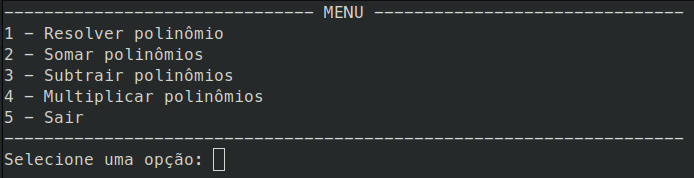
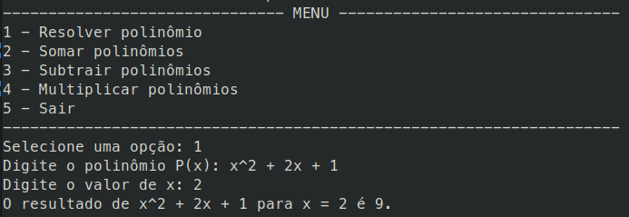
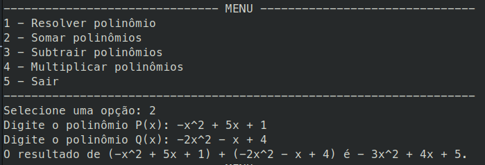
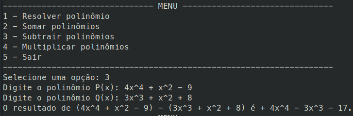
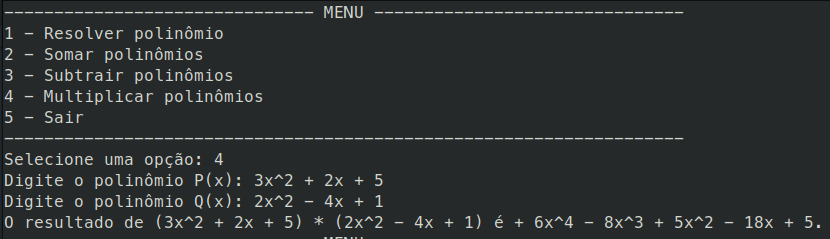
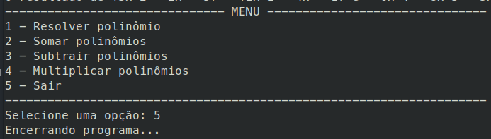

# Polynomial calculator


> Calculadora de polinômios feito em C. Operações suportadas: resolver, somar, subtrair e multiplicar polinômios de até grau 10.

## 💻 Demonstração

### Menu



### Resolver polinômios



### Somar polinômios



### Subtrair polinômios



### Multiplicar polinômios



### Encerramento



## ⚠️ Pré-requisitos

- [GCC 11.4.0+](https://gcc.gnu.org/install/download.html)
- [Make 4.3+](https://www.gnu.org/software/make/#download)

## 💡 Conceitos

- Estruturas de decisão
- Estruturas de repetição
- Funções
- Vetores
- Manipulação, formatação e mascaras de string
- Ponteiros
- `#define` guards
- Struct

> **Decisões técnicas de implementação**: clique [AQUI](./docs/technical-decision.md)

## 🚀 Execução do projeto

```bash
# Clone do repositório
$ git clone https://github.com/ImGabreuw/polynomial-calculator.git

# Acessar o diretório do projeto
$ cd polynomial-calculator

# Conceder acesso de execução aos scripts
$ chmod +x ./run.sh ./run-test.sh

# Executar o programa
$ ./run.sh

# (Opcional) Executar os casos de teste
$ ./run-test.sh

# (Opcional) Exibir os comandos permitidos pelo CLI
$ ./run.sh --help
# OU
$ ./main --help
```

## 📫 Contribuição

Para contribuir com **polynomial-calculator**, siga estas etapas:

1. Bifurque este repositório.
2. Crie um branch: `git checkout -b <nome da funcionalidade>`.
3. Faça suas alterações e confirme-as: `git commit -m '<breve descrição sobre a funcionalidade>'`
4. Envie para o branch original: `git push origin <feature/funcionalidade>`
5. Crie a solicitação de pull.

Como alternativa, consulte a documentação do GitHub
em [como criar uma solicitação pull](https://help.github.com/en/github/collaborating-with-issues-and-pull-requests/creating-a-pull-request).

## 🤝 Colaboradores

Agradecemos às seguintes pessoas que contribuíram para este projeto:

<table>
  <tr>
    <td align="center">
      <a href="https://github.com/ImGabreuw">
        <br>
        <sub>
          <b>ImGabreuw</b>
        </sub>
      </a>
    </td>
    <td align="center">
      <a href="https://github.com/Enzo-B-Proenca">
        <br>
        <sub>
          <b>Enzo-B-Proenca</b>
        </sub>
      </a>
    </td>
  </tr>
</table>

[⬆ Voltar ao topo](#polynomial-calculator)<br>